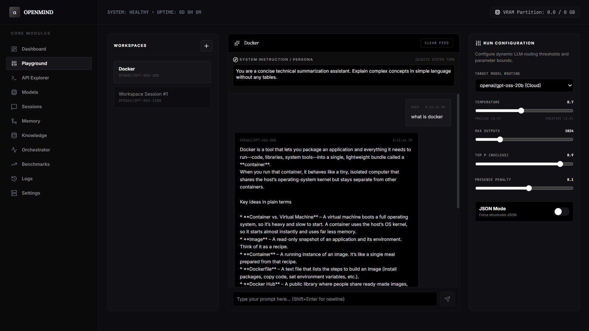
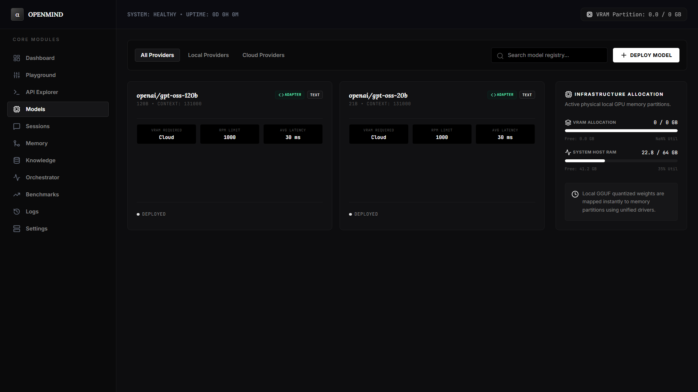
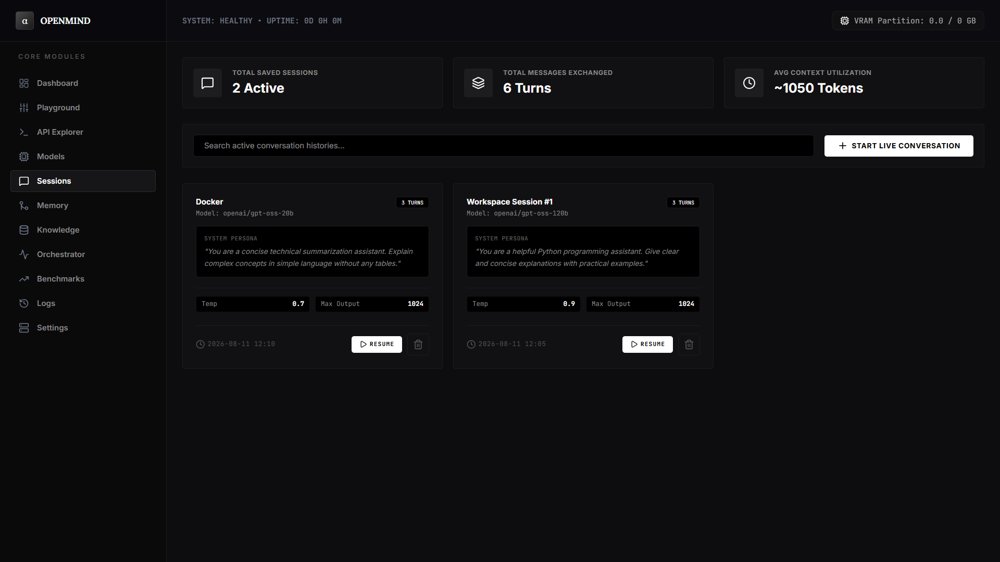

# 🧠 OpenMind AI Platform

[](https://www.python.org/)
[](https://fastapi.tiangolo.com/)
[](https://react.dev/)
[](LICENSE)
[](tests/)

**A unified AI model evaluation, RAG, and orchestration platform** — test and compare LLMs across providers, build knowledge retrieval pipelines, orchestrate multi-step AI workflows, and manage persistent AI memory — all from a single self-hosted environment.

---

## 🎯 Why OpenMind?

Working with AI models means juggling multiple providers, testing different configurations, and building the infrastructure to make AI actually useful. OpenMind solves this by providing:

- **One platform to test any LLM** — Switch between Gemini, GPT-4o, Llama 3, DeepSeek R1 and compare responses side-by-side with configurable inference parameters
- **RAG out of the box** — Upload documents (PDF, Markdown, TXT), chunk them, embed them, and retrieve relevant context for your prompts
- **Persistent AI memory** — Graph-based memory spanning Conversation, Semantic, and Long-Term tiers so your AI remembers context across sessions
- **Workflow orchestration** — Chain LLM calls, conditions, API integrations, memory lookups, and human approvals into automated multi-step pipelines
- **OpenAI-compatible gateway** — Any application that speaks OpenAI's API format can route requests through OpenMind with Bearer token authentication

> **Status**: Actively under development. Core platform is functional with API-driven models (Gemini). Expanding to local open-weight model hosting, real vector embeddings, and agentic workflow execution.

---

## 📸 Screenshots

| AI Playground | Model Registry | Chat Sessions |
|:---:|:---:|:---:|
| [](screenshots/Playground.png) | [](screenshots/Models.png) | [](screenshots/Sessions.png) |

---

## 🏗️ Architecture

```
┌─────────────────────────────────────────────────────────────────────┐
│                    CLIENT (React 19 + TypeScript)                    │
│   Dashboard · Playground · Models · Sessions · Memory · Knowledge   │
│   Orchestrator · Benchmarks · API Explorer · Logs · Settings        │
└────────────────────────────────┬────────────────────────────────────┘
                                 │  HTTP (Vite proxy: :3000 → :8000)
                                 ▼
┌─────────────────────────────────────────────────────────────────────┐
│                    API LAYER (FastAPI · 40+ Endpoints)               │
│   Routes · Pydantic Validation · Auth · Error Handling · SSE        │
└────────────────────────────────┬────────────────────────────────────┘
                                 │
                                 ▼
┌─────────────────────────────────────────────────────────────────────┐
│                    SERVICE LAYER (Business Logic)                    │
│   ChatService · ModelService · SessionService · KnowledgeService    │
│   WorkflowService · MemoryService · MonitoringService               │
└────────────────────────────────┬────────────────────────────────────┘
                                 │
                                 ▼
┌─────────────────────────────────────────────────────────────────────┐
│                    DATA LAYER (Repository Pattern)                   │
│   BaseRepository[T] → Async CRUD · 11 Domain Repositories          │
└────────────────────────────────┬────────────────────────────────────┘
                                 │
                                 ▼
┌─────────────────────────────────────────────────────────────────────┐
│                    PERSISTENCE & AI PROVIDERS                        │
│   SQLite / PostgreSQL 16 · pgvector · Google Gemini AI              │
└─────────────────────────────────────────────────────────────────────┘
```

**Design patterns**: Application Factory · Repository Pattern · Service Layer · Dependency Injection · DTO (Pydantic) · SSE Streaming · Singleton Config · Lifespan Context Manager

---

## ✅ Features

### Core AI Capabilities
| Feature | Status | Description |
|---------|--------|-------------|
| **AI Playground** | ✅ Live | Multi-session chat with configurable temperature, top_p, max_tokens, system prompts, and JSON mode |
| **SSE Streaming** | ✅ Live | Real-time token-by-token response streaming (OpenAI SSE protocol) |
| **Model Registry & Adapters** | ✅ Live | Deploy, test, and adapt any LLM or Dense Vector Embedding model (Gemini, NVIDIA NIM, HuggingFace, Ollama, vLLM) |
| **Universal Embedding Microserver** | ✅ Live | Built-in zero-wait runner (`embed_server.py` / `openmind-embed-server:latest`) for `BAAI/bge-small-en-v1.5`, `BAAI/bge-m3`, `all-MiniLM-L6-v2` |
| **All-in-One Generator Prompt** | ✅ Live | 1-click generator to convert any HuggingFace/NIM model into executable Docker scripts and Python adapter code |
| **Model Benchmarks** | ✅ Live | Compare TTFT, TPS, latency, accuracy, VRAM usage, and cost per 1K tokens |
| **OpenAI Gateway** | ✅ Live | OpenAI-compatible `/chat/completions` and `/embeddings` endpoints with Bearer auth |
| **API Key Management** | ✅ Live | Secure key generation with bcrypt hashing and prefix-based fast lookup |

### Knowledge & RAG
| Feature | Status | Description |
|---------|--------|-------------|
| **Document Ingestion** | ✅ Live | Upload PDF, Markdown, TXT files with automatic text extraction |
| **Text Chunking** | ✅ Live | Character and semantic chunking for RAG preparation |
| **Vector Embeddings** | ✅ Live | Real dense vector embeddings powered by deployed embedding adapters (BGE, Nemotron, OpenAI, etc.) stored in pgvector |
| **Semantic Retrieval** | ✅ Live | Cosine & vector similarity search over chunked knowledge sources |

### Memory & Orchestration
| Feature | Status | Description |
|---------|--------|-------------|
| **Memory Graph** | ✅ Live | Graph-based nodes and connections across Conversation, Semantic, Long-Term tiers |
| **Memory Logs** | ✅ Live | Track memory operations and tier transitions |
| **Workflow Definitions** | ✅ Live | Define multi-step workflows with LLM, Condition, API Call, Memory Fetch, Human Approval steps |
| **Workflow Execution** | 🚧 In Progress | Step execution engine (currently simulated, real execution planned) |

---

## ⚡ Self-Hosting Local Embedding Models (HuggingFace / BGE / NIM)

OpenMind includes a **Universal Embedding Microserver** (`embed_server.py`) and pre-built Docker image to self-host any HuggingFace embedding model locally on port `8001`.

### 1. Run BAAI/bge-small-en-v1.5 (or any HuggingFace model)

```powershell
# Run the pre-built instant image:
docker run -it --rm -p 8001:8001 -e MODEL_NAME="BAAI/bge-small-en-v1.5" openmind-embed-server:latest

# Or run directly via Python:
$env:MODEL_NAME = "BAAI/bge-small-en-v1.5"
python embed_server.py
```

### 2. Connect in OpenMind
1. In OpenMind (**http://localhost:3000**), click **Deploy** → **Embedding Model**.
2. Click **"Use BGE-Small (HuggingFace)"** or click **"Copy All-in-One Prompt"** for any custom model.
3. Click **"Check Port 8001"** (turns `🟢 Port 8001 Online`).
4. Click **"Run Embedding Test"** to inspect live vectors → Click **"Deploy Embedding Model"**!

---

## 🛠️ Tech Stack

### Backend
| Technology | Purpose |
|-----------|---------|
| Python 3.11+ | Core language |
| FastAPI 0.115 | Async web framework with auto-generated OpenAPI docs |
| SQLAlchemy 2.0 (Async) | ORM with async session management |
| Pydantic 2.x | Request/response validation and serialization |
| Google Generative AI | Gemini model integration |
| SQLite / PostgreSQL 16 | Development / Production database |
| pgvector | Vector similarity search extension |
| structlog | Structured logging |
| bcrypt | API key hashing |
| psutil | System resource monitoring |

### Frontend
| Technology | Purpose |
|-----------|---------|
| React 19 + TypeScript | Dashboard UI |
| Vite 6 | Build tool and dev server |
| TailwindCSS v4 | Styling |
| Framer Motion | Animations |

### Infrastructure
| Technology | Purpose |
|-----------|---------|
| Docker + Docker Compose | Containerization and orchestration |
| GitHub Actions | CI/CD pipeline |
| pytest + pytest-asyncio | Testing framework |
| Ruff + mypy | Linting and type checking |

---

## 📂 Project Structure

```text
openmind-ai-platform/
├── app/                        # FastAPI Backend
│   ├── api/routes/             # 13 route modules (chat, models, gateway, knowledge, etc.)
│   ├── core/                   # Config, database, lifespan, logging, seed
│   ├── models/                 # 12 SQLAlchemy ORM models (11 database tables)
│   ├── schemas/                # Pydantic request/response DTOs
│   ├── services/               # Business logic (Chat, Model, Session, Knowledge, Workflow, Memory, etc.)
│   └── storage/                # Repository pattern data access layer
├── client/                     # React 19 + TypeScript SPA (11 feature views)
├── tests/                      # pytest suite (59+ tests)
├── docker-compose.yml          # Production Docker Compose (FastAPI + PostgreSQL + pgAdmin)
├── Dockerfile                  # Multi-stage production build
└── requirements.txt            # Python dependencies
```

---

## 🚀 Quick Start

### Prerequisites
- **Python 3.11+**
- **Node.js 18+**
- *(Optional)* **Docker & Docker Compose** for PostgreSQL

### Backend

```bash
# Create virtual environment
python -m venv .venv

# Activate (Windows PowerShell)
.\.venv\Scripts\Activate.ps1

# Activate (Linux/macOS)
source .venv/bin/activate

# Install dependencies
pip install -r requirements.txt

# Configure environment
cp .env.example .env
# Add your GEMINI_API_KEY in .env

# Seed database
python -m app.core.seed

# Start server
python -m uvicorn app.main:app --reload --host 127.0.0.1 --port 8000
```

- **API**: http://localhost:8000
- **Swagger Docs**: http://localhost:8000/docs

### Frontend

```bash
cd client
npm install
npm run dev
```

- **Dashboard**: http://localhost:3000

---

## 🔌 API Endpoints

### OpenAI-Compatible Gateway (`/api/v1`)
| Method | Endpoint | Description |
|--------|----------|-------------|
| `POST` | `/api/v1/chat/completions` | Chat completion with Bearer token auth |
| `POST` | `/api/v1/embeddings` | Text embeddings |
| `GET` | `/api/v1/models` | Model listing |

### Core APIs
| Method | Endpoint | Description |
|--------|----------|-------------|
| `POST` | `/chat` `/chat/stream` | Chat completions & SSE streaming |
| `CRUD` | `/models` | AI model registry |
| `CRUD` | `/sessions` | Chat session management |
| `POST` | `/knowledge/upload` | Document ingestion |
| `CRUD` | `/workflows` | Workflow orchestration |
| `CRUD` | `/memory/nodes` | Memory graph management |
| `CRUD` | `/api-keys` | API key management |
| `GET` | `/api/status` | System monitoring |

---

## 🧪 Testing

```bash
python -m pytest
```

59+ unit and integration tests covering API endpoints, services, and configuration.

---

## 🗺️ Roadmap

- [ ] **Local Model Hosting** — Integrate Ollama/vLLM for running open-weight models (Llama 3, DeepSeek R1, Mistral) locally
- [ ] **Real Vector Embeddings** — Generate embeddings via Gemini/OpenAI embedding models, store in pgvector
- [ ] **Semantic RAG Retrieval** — Embedding-based similarity search over knowledge documents
- [ ] **Agentic Workflow Execution** — Real step executors for LLM calls, API requests, conditions, and memory operations
- [ ] **Multi-Provider Model Routing** — Dynamic routing across Gemini, OpenAI, Anthropic, and local models
- [ ] **Alembic Migrations** — Production-ready database schema management
- [ ] **Authentication** — JWT-based user authentication and role management
- [ ] **WebSocket Streaming** — Real-time system updates and workflow progress

---

## 👤 Author

**Basil C K** — AI Engineer

- Portfolio: [basilbaasi.github.io](https://basilbaasi.github.io)
- GitHub: [github.com/Basilbaasi](https://github.com/Basilbaasi)
- Email: basilck618@gmail.com

---

## 📜 License

MIT License. See [LICENSE](LICENSE) for details.
