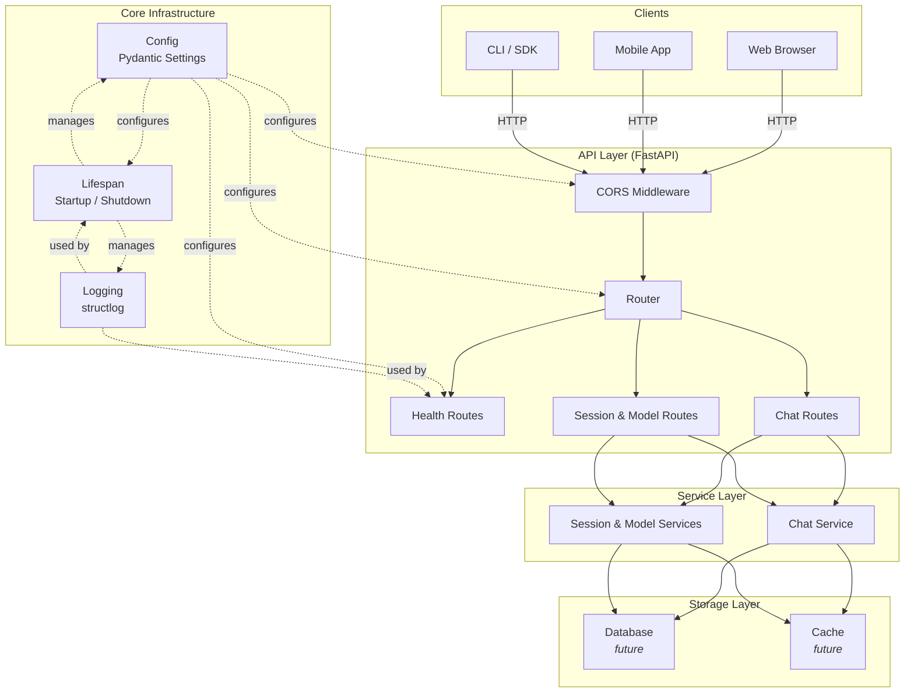
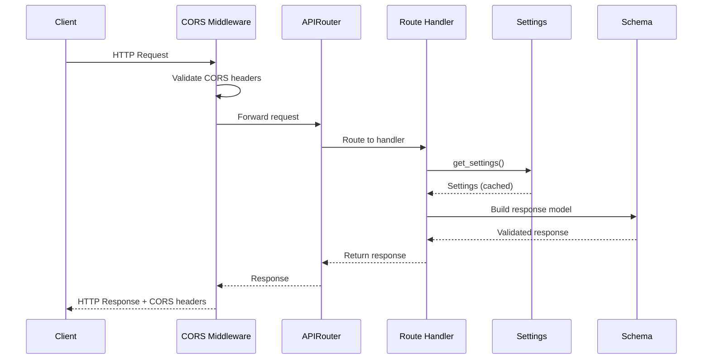
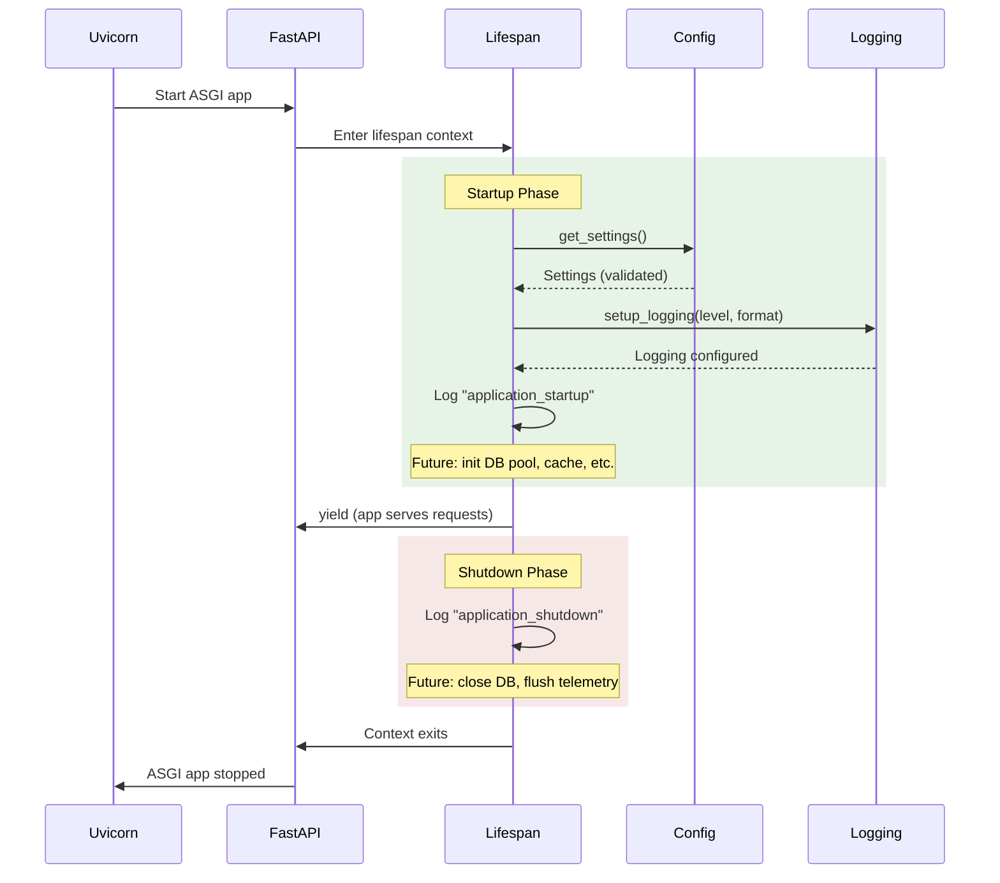
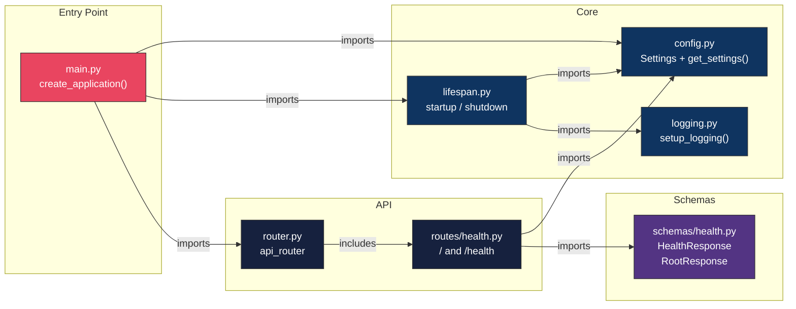

# OpenMind AI Platform — Architecture

This document describes the system architecture, component relationships, and request flow for the OpenMind AI Platform backend.

> **Scope:** This document reflects the v0.2.0 (API Contract Design) release. Components marked with *(future)* are planned for upcoming milestones.

---

## System Overview

The platform is a **Python FastAPI** application following a layered architecture with clear separation of concerns. Each layer communicates only with the layer directly below it, ensuring testability and modularity.



---

## Request Flow

Every HTTP request passes through the following pipeline:



### Example: `GET /health`

1. Client sends `GET /health`
2. CORS middleware validates origin headers
3. Router matches the path to `health_check()` handler
4. Handler calls `get_settings()` (returns cached singleton)
5. Handler constructs `HealthResponse` schema with status, version, environment, timestamp
6. Pydantic validates and serializes the response
7. FastAPI returns JSON with `200 OK`

---

## Application Startup

The application uses FastAPI's lifespan context manager for resource lifecycle management:



---

## Application Factory

The `create_application()` factory function constructs a fully configured FastAPI instance:


**Why a factory?**

| Benefit | Explanation |
|---------|-------------|
| **Testability** | Tests create fresh app instances — no shared state between test suites |
| **Flexibility** | ASGI servers import and call the factory directly |
| **Clarity** | All wiring (middleware, routers, lifespan) is explicit and centralized |

---

## Folder Architecture

```
openmind-ai-platform/
│
├── app/                          # Application source
│   ├── main.py                   # Application factory (create_application)
│   ├── api/                      # HTTP layer
│   │   ├── router.py             # Central router — aggregates all domain routers
│   │   ├── errors.py             # Global exception handlers
│   │   └── routes/               # Individual route modules
│   │       ├── health.py         # GET / and GET /health handlers
│   │       ├── chat.py           # POST /chat and /chat/stream
│   │       ├── sessions.py       # Session CRUD handlers
│   │       └── models.py         # Model discovery handlers
│   ├── core/                     # Cross-cutting infrastructure
│   │   ├── config.py             # Settings class + get_settings() singleton
│   │   ├── lifespan.py           # Async startup/shutdown lifecycle
│   │   └── logging.py            # structlog configuration
│   ├── schemas/                  # Pydantic DTOs (request/response models)
│   │   ├── health.py             # HealthResponse, RootResponse
│   │   ├── errors.py             # APIError, ErrorDetail
│   │   ├── chat.py               # ChatRequest, ChatResponse, etc.
│   │   ├── sessions.py           # Session schemas
│   │   └── models.py             # Model metadata schemas
│   ├── models/                   # Domain/ORM models (future)
│   ├── services/                 # Business logic
│   │   ├── chat_service.py       # Mock chat generation & streaming
│   │   ├── session_service.py    # Mock session CRUD logic
│   │   └── model_service.py      # Mock model discovery
│   ├── storage/                  # Persistence adapters (future)
│   └── utils/                    # Shared helpers
│
├── tests/                        # Automated test suite
│   ├── conftest.py               # Shared fixtures (app, async_client)
│   ├── test_health.py            # Endpoint tests
│   ├── test_config.py            # Configuration tests
│   └── test_application.py       # App factory & lifecycle tests
│
├── docs/                         # Project documentation
├── scripts/                      # Developer utility scripts
├── docker/                       # Docker-related configs (future)
├── benchmarks/                   # Performance benchmarks (future)
└── .github/workflows/            # CI/CD pipeline definitions
```

---

## Component Relationships



---

## Design Principles

| Principle | Implementation |
|-----------|----------------|
| **Separation of Concerns** | Each layer (API, Service, Storage) has a single responsibility |
| **Dependency Injection** | Services are injected via FastAPI's `Depends()` |
| **Configuration as Code** | All settings are environment-driven and validated at startup |
| **Fail Fast** | Invalid configuration is caught at startup, not at request time |
| **Testability** | Factory pattern + async client fixtures enable isolated testing |
| **12-Factor Compliance** | Config from env vars, stateless processes, port binding |

---

## Technology Stack

| Component | Technology | Purpose |
|-----------|-----------|---------|
| Web Framework | FastAPI 0.115 | Async ASGI framework with auto-docs |
| ASGI Server | Uvicorn 0.34 | High-performance async server |
| Validation | Pydantic 2.11 | Data validation and serialization |
| Configuration | pydantic-settings 2.9 | Type-safe env var loading |
| Logging | structlog 25.4 | Structured logging (JSON + text) |
| HTTP Client | httpx 0.28 | Async HTTP client (for future LLM calls) |
| Testing | pytest 8.4 + pytest-asyncio | Async test framework |
| Linting | Ruff 0.11 | Fast Python linter and formatter |
| Type Checking | mypy 1.16 | Static type analysis |
| Containerization | Docker + Compose | Production deployment |
